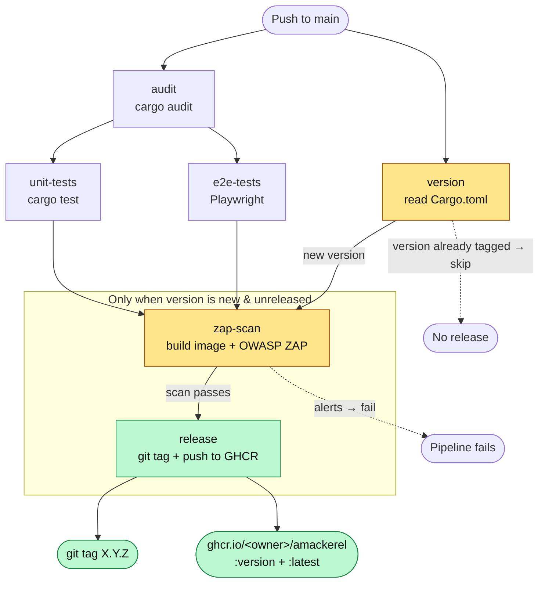
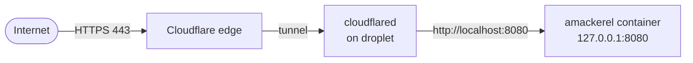

<p align="center">
  
</p>

# amackerel

A simple developer blog built with [Leptos](https://github.com/leptos-rs/leptos)
(SSR + hydration) on [Axum](https://github.com/tokio-rs/axum). Write posts as
markdown files, drop them in `posts/`, and they render as pages.

## Features

- **Blog-first home page** (`/`) — short bio, then all posts newest-first.
- **Markdown posts** — each `posts/*.md` file becomes a page at `/posts/<slug>`.
- **About page** (`/about`) — separate "who I am" page, linked in the nav.
- Rendered server-side with `pulldown-cmark`; frontmatter drives title/date/description.
- **Security-hardened** responses (CSP, X-Frame-Options, nosniff, COEP, etc.).

## Writing a post

Create a file in `posts/`, e.g. `posts/my-project.md`:

```md
---
title: "My Project"
date: "2026-07-02"
description: "Short summary shown in the post list."
---

# My Project

Standard markdown below — headings, lists, code blocks, tables, quotes.
```

- The **filename** (minus `.md`) is the URL slug — this lives at `/posts/my-project`.
- Posts are sorted **newest-first** by the `date` field.
- `title`, `date`, `description` are optional; a missing `title` falls back to the slug.

## Project layout

```text
posts/               markdown blog posts (read at runtime by the server)
src/app.rs           routes, nav, and page components (edit bio + About here)
src/blog.rs          post types, markdown rendering, list_posts/get_post server fns
src/main.rs          Axum server + security-headers middleware
style/main.scss      site styling
public/              static assets (favicon, etc.)
end2end/             Playwright end-to-end tests
Dockerfile           two-stage Alpine build (nightly builder → tiny runtime)
.github/workflows/   CI/CD pipeline
infrastructure/      OpenTofu/Terraform: DO droplet + Cloudflare tunnel + cloud-init startup
```

## Running

```bash
cargo leptos watch
```

Open http://127.0.0.1:3000

## Prerequisites

`cargo-leptos` uses nightly Rust and dart-sass. If something is missing:

1. `cargo install cargo-leptos --locked`
2. `rustup toolchain install nightly --allow-downgrade`
3. `rustup target add wasm32-unknown-unknown` (also declared in `rust-toolchain.toml`)
4. `npm install -g sass`
5. `npm install` in the `end2end` directory before running tests

## Testing

```bash
# Unit tests
cargo test --features ssr --no-default-features

# End-to-end (builds app, serves on :3000, runs Playwright)
cargo leptos end-to-end
```

Playwright specs live in `end2end/tests`.

## Docker

Two-stage build: Alpine + Rust nightly builder → bare Alpine runtime (~20 MB).

```bash
docker build -t amackerel .
docker run -p 8080:8080 amackerel
```

Open http://localhost:8080

> **Note:** the server reads `posts/` at runtime relative to its working
> directory. The image copies `posts/` in; if you mount your own, mount it at
> `/app/posts`.

## Security headers

`src/main.rs` layers hardening headers onto every response: `Content-Security-Policy`,
`X-Frame-Options: DENY`, `X-Content-Type-Options: nosniff`, `Referrer-Policy`,
`Permissions-Policy`, and the cross-origin isolation trio (COEP/COOP/CORP).

The CSP allows `'wasm-unsafe-eval'` and `'unsafe-inline'` scripts — both required
for Leptos hydration. Don't remove them without switching to a nonce-based CSP,
or hydration breaks.

## CI/CD

`.github/workflows/ci.yml` runs on every push to `main`. The release version is
read from `Cargo.toml`. When tests + scan pass **and** that version isn't already
tagged, the pipeline tags the commit, then builds and publishes the image.



| Stage | What it does |
|-------|--------------|
| **version** | reads `Cargo.toml` version; releases only if that tag doesn't exist yet |
| **audit** | `cargo audit` — fails on any advisory |
| **unit-tests** | `cargo test` (runs in parallel with e2e) |
| **e2e-tests** | Playwright suite (runs in parallel with unit) |
| **zap-scan** | builds the image, runs it, OWASP ZAP baseline scan |
| **release** | creates the `X.Y.Z` git tag, then pushes the *scanned* image to GHCR |

- Every push to `main` runs audit + tests.
- If the `Cargo.toml` version is **new** (no matching tag), on success the pipeline
  tags the commit `X.Y.Z` (bare semver, no `v`) and publishes
  `ghcr.io/<owner>/amackerel:<version>` and `:latest`.
- If the version is **unchanged**, the release path is skipped — bump the version
  in `Cargo.toml` to cut a new release.

The image ZAP scans is saved and re-loaded by the release job, so you publish
precisely the bytes that were tested (not a rebuild).

### Cutting a release

Bump the version in `Cargo.toml`, then push to `main`:

```toml
[package]
version = "0.1.1"
```

The pipeline tags `0.1.1` and publishes on success. Pull the image:

```bash
docker pull ghcr.io/alixmacdonald10/amackerel:latest
```

## Infrastructure

Production runs on a single [DigitalOcean](https://www.digitalocean.com/) droplet,
provisioned with [OpenTofu](https://opentofu.org/)/Terraform in `infrastructure/`.
Terraform creates the DO droplet **and** the Cloudflare Zero Trust tunnel — the
tunnel, its ingress config, and the `amackerel.dev` DNS record are all managed as
code (no dashboard click-ops). The droplet boots via a cloud-init script that
installs Docker + `cloudflared`, runs the latest published image, and exposes it
through the tunnel.

```text
infrastructure/providers.tf           terraform block, providers, R2 state backend
infrastructure/variables.tf           input variables (tokens, account/zone IDs, image)
infrastructure/locals.tf              project_name local reused across resources
infrastructure/do.tf                  DO project, SSH key, droplet, firewall
infrastructure/cloudflare.tf          tunnel + connector token + ingress config + DNS record
infrastructure/cloud-init.yaml.tftpl  droplet startup script (templated)
infrastructure/terraform.tfvars       secrets + IDs — gitignored, you create this
infrastructure/r2.backend.hcl         R2 state-backend creds — gitignored, you create this
```

The tunnel secret is generated by `random_id` (base64 — Cloudflare rejects raw
special chars), and the droplet's `cloudflared --token` value comes from the
`cloudflare_zero_trust_tunnel_cloudflared_token` data source, passed into
cloud-init. The last ingress rule is the required catch-all (`http_status:404`).

The startup script installs Docker + `cloudflared`, then runs two systemd
services: `amackerel.service` (the app) and `watchtower.service` (auto-updater).

State is stored remotely in a **Cloudflare R2 bucket** (`amackerel-iac`) via the
S3-compatible `backend "s3"` block in `providers.tf`. R2 isn't real S3, so the backend
sets `use_path_style`, `region = "auto"`, and skips the AWS-specific
validation/metadata calls. Credentials are supplied at init time from
`r2.backend.hcl` (see [Deploying](#deploying)).

### How it fits together



- The container binds **`127.0.0.1:8080` only** — port 8080 is never exposed on the
  droplet's public IP. All traffic arrives through the Cloudflare tunnel.
- A **DigitalOcean firewall** (`amackerel-waf`) fronts the droplet: inbound allows
  **only TCP 22 (SSH)**; all other inbound is dropped. Outbound TCP/UDP is open
  (needed for the tunnel, image pulls, and apt). The public site is never served
  from the droplet — 443/80 are not open inbound — so the tunnel is the only path in.
- Cloudflare terminates TLS at its edge (443) and forwards to `localhost:8080`.
  The ingress rule (`amackerel.dev` → `http://localhost:8080`) is defined in
  `cloudflare.tf` (`cloudflare_zero_trust_tunnel_cloudflared_config`), and a
  proxied `CNAME` DNS record routes `amackerel.dev` at the tunnel — both managed
  by Terraform, not the dashboard.
- `amackerel.service` (systemd) pulls `ghcr.io/alixmacdonald10/amackerel:latest`
  and runs it with `Restart=always`.
- `watchtower.service` runs [Watchtower](https://github.com/nicholas-fedor/watchtower),
  which polls the registry every 5 min and recreates the container **only when
  the `:latest` digest changes** — so a new release auto-deploys with no SSH.
  `--cleanup` prunes the superseded image. Force an immediate redeploy with
  `systemctl restart amackerel`.

### Prerequisites

1. A DigitalOcean API token, **scoped** with read/write on: `droplet`, `ssh_key`,
   `tag`, `project` and `firewall`. Anything narrower and `tofu apply` fails to manage those
   resources.
2. An SSH key at `~/.ssh/id_ed25519_do_amackerel.pub` (path in `do.tf`).
3. A Cloudflare **API token** (dashboard → My Profile → API Tokens). Terraform
   creates the tunnel, its config, and the DNS record, so the token needs both
   zone and account permissions. The token in use is scoped:

   - **Zone → `amackerel.dev`:** Zone DNS Settings Write/Read, DNS Write/Read
   - **Account → your account:** DNS View Write/Read, Account DNS Settings
     Write/Read, Cloudflare One Connector: cloudflared Write/Read, Workers R2
     Storage Write/Read, DNS Firewall Write/Read

   At minimum you need **DNS: Edit** on the zone and **Cloudflare One Connector:
   cloudflared: Edit** on the account — without DNS Edit the record create 403s,
   without the connector scope the tunnel create fails.
4. Your Cloudflare **account ID** and the **zone ID** for `amackerel.dev`
   (dashboard → the zone → API section on the overview page).
5. A Cloudflare **R2 bucket** named `amackerel-iac` for Terraform state, plus an
   **R2 API token** (Cloudflare dashboard → R2 → Manage API Tokens) — gives the
   Access Key ID / Secret Access Key used by the backend. (The R2 Storage scopes
   above cover this if you reuse the same token.)

### Deploying

Create `infrastructure/terraform.tfvars` (gitignored — never commit it):

```hcl
do_token               = "dop_v1_..."
cloudflare_api_token   = "cfat_..."
cloudflare_account_id  = "<cloudflare-account-id>"
cloudflare_dns_zone_id = "<amackerel.dev-zone-id>"
# image = "ghcr.io/alixmacdonald10/amackerel:latest"  # optional override
```

The tunnel connector token is **not** a variable — Terraform generates the tunnel
secret and derives the token itself, so cloud-init gets it automatically.

Create `infrastructure/r2.backend.hcl` for the R2 state backend (also gitignored —
backend config can't read `terraform.tfvars`, so it lives in its own file):

```hcl
access_key = "<r2-access-key-id>"
secret_key = "<r2-secret-access-key>"
```

Then:

```bash
cd infrastructure
tofu init -backend-config=r2.backend.hcl      # or: terraform init ...
tofu apply
```

Migrating an existing local state into R2 the first time? Add `-migrate-state`:

```bash
tofu init -migrate-state -backend-config=r2.backend.hcl
```

Cloud-init runs on first boot (a few minutes). Once `cloudflared` connects, the
site is live at your tunnel hostname. To ship a new build, just publish a release
(bump `Cargo.toml`) — Watchtower picks up the new `:latest` within ~5 min and
redeploys automatically. No SSH needed.

> **Secrets:** `terraform.tfvars` and `r2.backend.hcl` hold live credentials. Both
> are gitignored, but keep them off shared machines and rotate the tokens if they
> leak. App vars can also be passed via `-var=...` or `TF_VAR_do_token` /
> `TF_VAR_cf_tunnel_token`; the R2 backend creds can instead come from
> `AWS_ACCESS_KEY_ID` / `AWS_SECRET_ACCESS_KEY` env vars, skipping the
> `-backend-config` file.

### Troubleshooting

SSH in (`ssh root@<droplet-ip>`), then work top-down — first-boot setup, then app,
then tunnel:

```bash
# Did the startup script finish? (errors: [] means clean)
cloud-init status --long
tail -n 50 /var/log/cloud-init-output.log      # full boot-time output

# App: service up, container running, responding on localhost:8080?
systemctl status amackerel --no-pager
docker ps -a                                   # STATUS should be "Up"
docker logs amackerel --tail 50
curl -sS -o /dev/null -w "%{http_code}\n" http://localhost:8080   # expect 200

# Auto-updater
systemctl status watchtower --no-pager
journalctl -u watchtower --no-pager -n 50

# Tunnel: connected to Cloudflare edge?
systemctl status cloudflared --no-pager
journalctl -u cloudflared --no-pager -n 50
```

Common cases:

| Symptom | Likely cause / fix |
|---------|--------------------|
| `cloud-init status` shows `error` | read `cloud-init-output.log` — apt or image pull failed on boot |
| container not in `docker ps` | bad image pull; `journalctl -u amackerel` (GHCR 404? tag typo?) |
| `curl` ≠ `200` | app crashed inside container — `docker logs amackerel` |
| app returns 200 but site is down | tunnel: check `cloudflared` logs **and** the dashboard ingress rule points at `http://localhost:8080` |
| `watchtower` failing to start | `journalctl -u watchtower`; often a Docker API-version mismatch after a Docker upgrade |

Force an immediate redeploy of the latest image (bypass the 5-min poll):

```bash
systemctl restart amackerel
```

## Deploying without the toolchain

After `cargo leptos build --release`, the minimum files needed are:

1. The server binary in `target/release`
2. The `target/site` directory and its contents
3. The `posts/` directory (read at runtime)

Set these environment variables as needed:

```sh
export LEPTOS_ENV="PROD"
export LEPTOS_OUTPUT_NAME="amackerel"
export LEPTOS_SITE_ROOT="site"
export LEPTOS_SITE_PKG_DIR="pkg"
export LEPTOS_SITE_ADDR="0.0.0.0:3000"
export LEPTOS_RELOAD_PORT="3001"
```

Then run the server binary.

## License

See [LICENSE](LICENSE).
