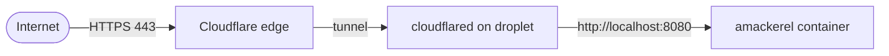

<!--
DRAFT SCAFFOLD — section headers + notes only. Fill each section with prose.
Series: "Zero-Exposure" (1 of 3). Next: Defense in the Response.
-->

# The Locked Front Door

<!--
HOOK: public blog, live at a real hostname, but the droplet has NO inbound 80/443.
State the puzzle up front: how does traffic get in if the web ports are closed?
-->

## The naive way, and why I skipped it

<!--
- Normal path: open 80/443, TLS cert on origin, reverse proxy, fail2ban, patch treadmill.
- List the attack surface that creates (public port scan target, cert management, DDoS on origin).
- Frame the rest of the post as: what if none of that is reachable?
-->

## The perimeter: a firewall that only speaks SSH

<!--
- DigitalOcean firewall `amackerel-waf`. Inbound = TCP 22 only. Outbound = all TCP/UDP.
- No inbound 80/443 at all — web ports never reachable from the internet, full stop.
- CODE: paste the inbound_rule / outbound_rule blocks from infrastructure/main.tf.
-->

```hcl
# infrastructure/main.tf — inbound is SSH and nothing else
```

## The bind: loopback only

<!--
- docker run -p 127.0.0.1:8080:8080 — container binds to loopback, not the public iface.
- Even if the firewall vanished, nothing listens on the public IP for web.
- Defense in depth: two independent layers each say "no".
- CODE: the ExecStart line from cloud-init.yaml.tftpl (amackerel.service).
-->

## The path in: an outbound Cloudflare tunnel

<!--
- cloudflared dials OUT to the Cloudflare edge; the edge holds the connection open.
- Nothing inbound is opened — the tunnel is established from inside.
- Traffic flow: internet -> edge (TLS 443) -> tunnel -> localhost:8080.
- DIAGRAM: reuse the mermaid flow from the README (internet -> edge -> cloudflared -> container).
-->



## What this buys

<!--
- No origin TLS certs to manage — TLS terminates at the edge.
- DDoS / WAF / caching handled at Cloudflare's edge.
- Hostname -> localhost:8080 ingress is configured dashboard-side on the named tunnel.
- Attacker has nothing to port-scan except SSH.
-->

## State stays off the machine too

<!--
- Terraform state lives in Cloudflare R2 (S3-compatible backend), bucket amackerel-iac.
- R2 quirks: use_path_style, region "auto", skip the AWS-specific validation calls.
- Backend creds supplied out-of-band via r2.backend.hcl (gitignored, never in state).
- DO API token scoped narrow: droplet, ssh_key, tag, firewall only.
- Point: infra is reproducible, secrets are not baked into the droplet.
-->

## The tradeoffs (being honest)

<!--
- SSH (22) is still open to the world — mitigations: key-only auth, could scope source IPs / move behind tunnel too.
- Hard dependency on Cloudflare — single vendor for the ingress path.
- The tunnel is a moving part (cloudflared must stay up; see the troubleshooting flow).
- What I'd change at higher scale.
-->

## Takeaway

<!--
- Expose nothing you don't have to.
- One outbound tunnel + one SSH port beats a hardened public web server.
- Tease article 2: the perimeter is shut, but what about the responses the app sends back?
-->
